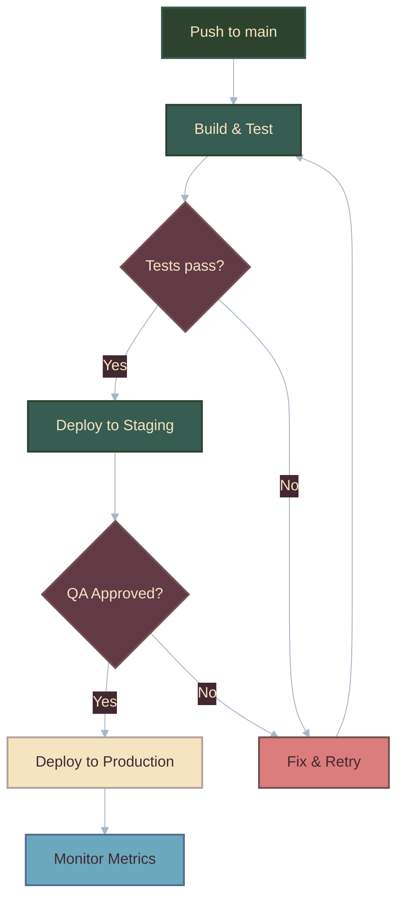
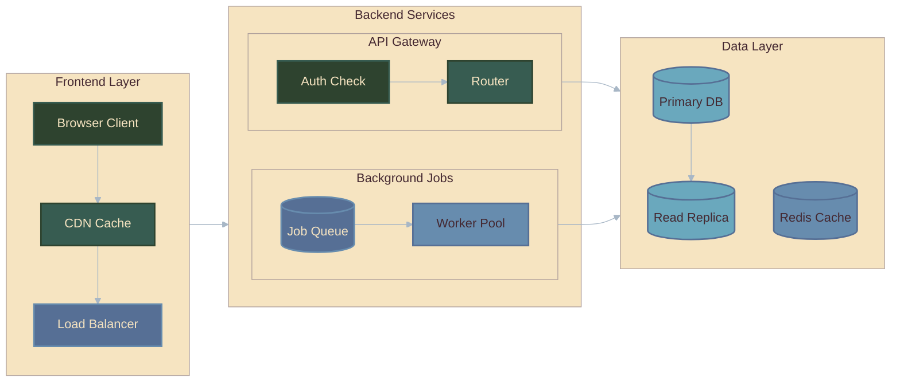
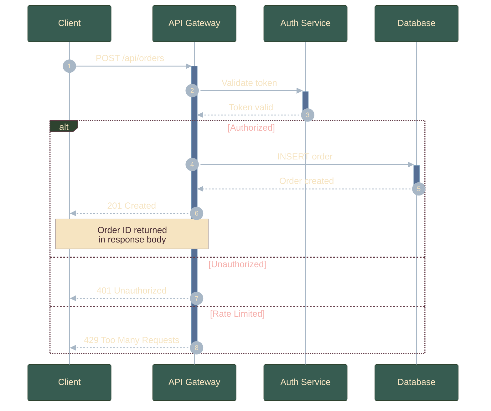
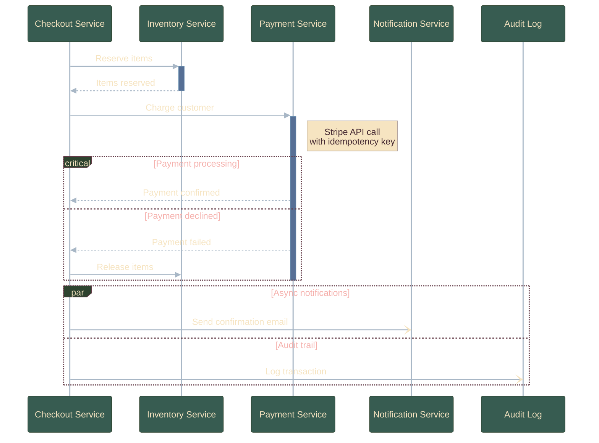
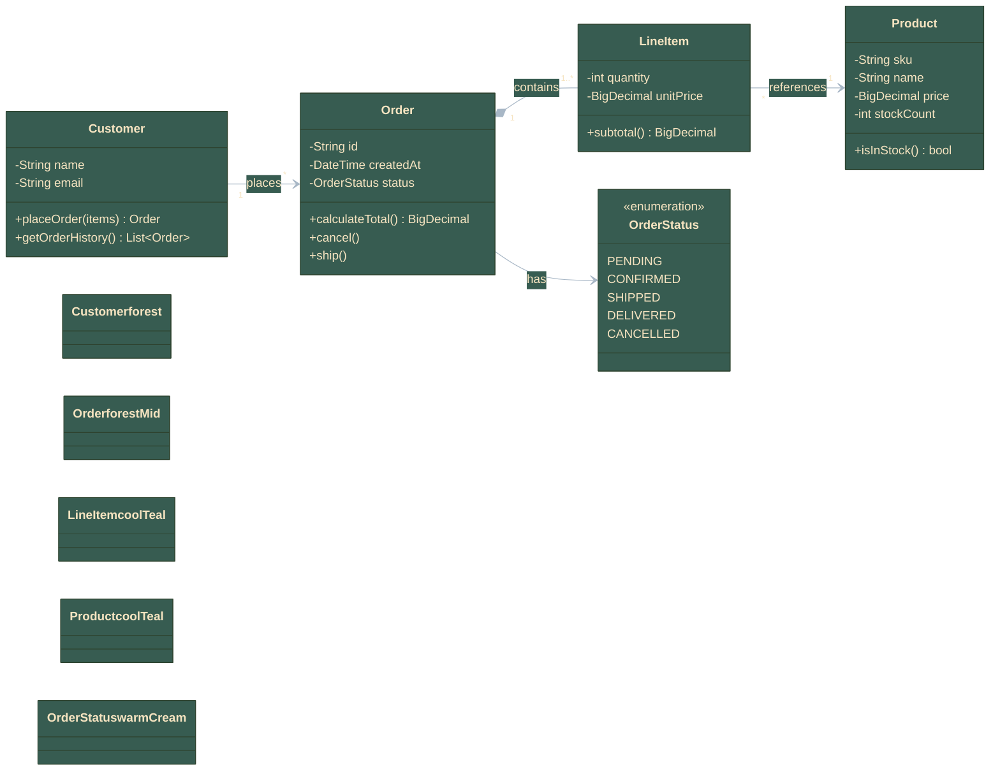

# Mermaid Diagram Generator

Generate high-quality, themed Mermaid diagram code based on user requirements.

## Workflow

1. **Understand Requirements**: Analyze the user's description to determine the best diagram type
2. **Select Syntax**: Use the correct syntax reference for that diagram type (below)
3. **Generate Code**: Produce valid Mermaid code following the specification
4. **Apply Theme**: Always include the dotoppenal16 theme init block and appropriate classDef styles
5. **Output**: Wrap in a ```mermaid code block that renders directly

User requirements: $ARGUMENTS

---

## Output Rules

1. Always wrap output in ```mermaid code blocks
2. Always include the full theme init block at the top (flowchart/class vs sequence variants differ)
3. Use semantic node IDs (not A, B, C; use descriptive names like `Auth`, `DB`, `Client`)
4. Include classDef definitions and class assignments for flowcharts and class diagrams
5. Use proper indentation and line breaks for readability
6. Ensure every `+` activation is balanced with a `-` deactivation in sequence diagrams

---

# THEME: dotoppenal16

A nature-inspired, desaturated palette. Earthy darks, muted greens, warm pastels, cool lights.

## Palette

| Role | Dark | Mid | Light | Lightest |
|------|------|-----|-------|----------|
| Earth | `#442831` | `#623a46` | `#755151` | `#a17a60` |
| Forest | `#2e432f` | `#375c51` | `#566f95` | `#678cae` |
| Warm | `#dc7d7d` | `#f5b0ac` | `#f6e4c1` | `#b1a29d` |
| Cool | `#6aa8bd` | `#abf1f5` | `#c1d3f7` | `#a8b7c6` |

## Theme Init Block: Flowcharts & Class Diagrams

```
%%{init: {'theme': 'base', 'themeVariables': {
  'primaryColor': '#375c51',
  'primaryTextColor': '#f6e4c1',
  'primaryBorderColor': '#2e432f',
  'secondaryColor': '#678cae',
  'secondaryTextColor': '#442831',
  'secondaryBorderColor': '#566f95',
  'tertiaryColor': '#a17a60',
  'tertiaryTextColor': '#f6e4c1',
  'tertiaryBorderColor': '#755151',
  'noteBkgColor': '#f6e4c1',
  'noteTextColor': '#442831',
  'noteBorderColor': '#b1a29d',
  'lineColor': '#a8b7c6',
  'textColor': '#f6e4c1',
  'mainBkg': '#375c51',
  'nodeBorder': '#2e432f',
  'clusterBkg': '#f6e4c1',
  'clusterBorder': '#b1a29d',
  'titleColor': '#442831',
  'edgeLabelBackground': '#442831',
  'nodeTextColor': '#f6e4c1'
}}}%%
```

## Theme Init Block: Sequence Diagrams

```
%%{init: {'theme': 'base', 'themeVariables': {
  'primaryColor': '#375c51',
  'primaryTextColor': '#f6e4c1',
  'primaryBorderColor': '#2e432f',
  'secondaryColor': '#678cae',
  'secondaryTextColor': '#442831',
  'secondaryBorderColor': '#566f95',
  'tertiaryColor': '#a17a60',
  'tertiaryTextColor': '#f6e4c1',
  'tertiaryBorderColor': '#755151',
  'actorBkg': '#375c51',
  'actorTextColor': '#f6e4c1',
  'actorBorder': '#2e432f',
  'actorLineColor': '#a8b7c6',
  'signalColor': '#a8b7c6',
  'signalTextColor': '#f6e4c1',
  'labelBoxBkgColor': '#2e432f',
  'labelBoxBorderColor': '#623a46',
  'labelTextColor': '#f6e4c1',
  'loopTextColor': '#f5b0ac',
  'activationBkgColor': '#566f95',
  'activationBorderColor': '#678cae',
  'sequenceNumberColor': '#f6e4c1',
  'noteBkgColor': '#f6e4c1',
  'noteTextColor': '#442831',
  'noteBorderColor': '#b1a29d'
}}}%%
```

## classDef Definitions (for flowcharts and class diagrams)

Include only the classes you actually use. Pick from this set:

```
classDef earth fill:#442831,stroke:#623a46,stroke-width:2px,color:#f6e4c1
classDef earthMid fill:#623a46,stroke:#755151,stroke-width:2px,color:#f6e4c1
classDef earthLight fill:#755151,stroke:#a17a60,stroke-width:2px,color:#f6e4c1
classDef earthWarm fill:#a17a60,stroke:#755151,stroke-width:2px,color:#442831

classDef forest fill:#2e432f,stroke:#375c51,stroke-width:2px,color:#f6e4c1
classDef forestMid fill:#375c51,stroke:#2e432f,stroke-width:2px,color:#f6e4c1
classDef forestBlue fill:#566f95,stroke:#678cae,stroke-width:2px,color:#f6e4c1
classDef steel fill:#678cae,stroke:#566f95,stroke-width:2px,color:#442831

classDef warmRose fill:#dc7d7d,stroke:#755151,stroke-width:2px,color:#442831
classDef warmPink fill:#f5b0ac,stroke:#dc7d7d,stroke-width:2px,color:#442831
classDef warmCream fill:#f6e4c1,stroke:#b1a29d,stroke-width:2px,color:#442831
classDef warmTaupe fill:#b1a29d,stroke:#a17a60,stroke-width:2px,color:#442831

classDef coolTeal fill:#6aa8bd,stroke:#566f95,stroke-width:2px,color:#442831
classDef coolCyan fill:#abf1f5,stroke:#6aa8bd,stroke-width:2px,color:#442831
classDef coolLavender fill:#c1d3f7,stroke:#a8b7c6,stroke-width:2px,color:#442831
classDef coolSilver fill:#a8b7c6,stroke:#678cae,stroke-width:2px,color:#442831
```

## Semantic Class Pairings

| Purpose | Class | Visual |
|---|---|---|
| Primary action / entry point | `forestMid` | Green fill, cream text |
| Decision point | `earthMid` | Mauve fill, cream text |
| Warning / error / failure | `warmRose` | Muted red fill, dark text |
| Success / output / result | `warmCream` | Cream fill, dark text |
| Info / reference / data | `coolTeal` | Blue fill, dark text |
| Inactive / archived / secondary | `coolSilver` | Grey fill, dark text |
| Origin / source | `forest` | Dark green fill, cream text |
| Processing / intermediate | `forestBlue` | Blue-grey fill, cream text |

---

# FLOWCHART REFERENCE

## Declaration

```
flowchart DIRECTION
```

Directions: `TD`/`TB` (top-down), `BT`, `LR`, `RL`. `graph` is an alias for `flowchart`.

## Node Shapes

| Shape | Syntax | Example |
|---|---|---|
| Rectangle | `id[text]` | `A[Process]` |
| Rounded rectangle | `id(text)` | `A(Start)` |
| Stadium / pill | `id([text])` | `A([Terminal])` |
| Subroutine | `id[[text]]` | `A[[Subprocess]]` |
| Cylinder (database) | `id[(text)]` | `A[(Database)]` |
| Circle | `id((text))` | `A((Event))` |
| Diamond (decision) | `id{text}` | `A{Decision?}` |
| Hexagon | `id{{text}}` | `A{{Prepare}}` |
| Parallelogram | `id[/text/]` | `A[/Input/]` |
| Trapezoid | `id[/text\]` | `A[/Priority\]` |

**Gotcha**: Cylinder is `[(text)]` not `[text]`. The parentheses inside brackets are required.
**Gotcha**: Diamond uses `{text}` not `<text>`.

## Links / Edges

| Syntax | Description |
|---|---|
| `-->` | Solid line with arrowhead |
| `---` | Solid line, no arrow |
| `-.->` | Dotted line with arrowhead |
| `==>` | Thick line with arrowhead |
| `--x` | Solid line with cross end |
| `<-->` | Bidirectional arrows |
| `~~~` | Invisible link (layout control) |

Text on links: `A -->|label| B` or `A -- label --> B`

Extra dashes = longer links: `-->` < `--->` < `---->`.

## Subgraphs

```
subgraph title
    nodes and edges
end
```

With explicit ID: `subgraph myId [Display Title]`

Nesting supported. Each subgraph can override direction with `direction TB/LR/etc`.

Link subgraphs by ID: `subgraphOne --> subgraphTwo`

**Gotcha**: If any node inside a subgraph links directly to an outside node (not via subgraph ID), the subgraph's `direction` override is ignored.

## Styling

Define: `classDef myClass fill:#375c51,stroke:#2e432f,stroke-width:2px,color:#f6e4c1`
Apply: `class A,B,C myClass`
Inline: `A:::myClass --> B`
Edges: `linkStyle 0 stroke:#a8b7c6,stroke-width:2px`

## Text

- Unicode: `A["Text with unicode"]`
- Markdown: `A["` `` `This is **bold**` `` `"]`
- Entity codes: `#quot;` for `"`, `#9829;` for heart, `#35;` for `#`
- **Never use lowercase `end` as node text** (breaks parser). Use `"end"`, `End`, or `[end]`.

---

# SEQUENCE DIAGRAM REFERENCE

## Declaration

```
sequenceDiagram
```

## Participants

```
participant Alice
actor Bob
participant API as API Gateway
participant DB@{ "type": "database" } as User Database
```

Types: `participant`, `actor`, `boundary`, `control`, `entity`, `database`, `collections`, `queue`

**Gotcha**: After declaring an alias, use the SHORT name in all messages. `A->>J: Hello` not `Alice->>John: Hello`.

## Messages / Arrows

| Arrow | Description |
|---|---|
| `->>` | Solid with arrowhead (synchronous call) |
| `-->>` | Dotted with arrowhead (return/response) |
| `-x` | Solid with cross (failed/rejected) |
| `-)` | Solid with open arrow (async) |
| `--)` | Dotted with open arrow (async) |

**Gotcha**: Use `->>` for calls and `-->>` for returns. Single-arrow `->` and `-->` draw lines WITHOUT arrowheads.

## Activations

Shorthand (recommended): `Alice->>+John: Request` / `John-->>-Alice: Response`

Every `+` must be balanced with a `-`.

## Notes

```
Note right of Alice: Text
Note over Alice,John: Spanning note
```

Line breaks: `Note over Alice: Line 1<br/>Line 2`

## Control Flow

```
loop Every 5 seconds
    Server->>Client: Heartbeat
end

alt Success
    API-->>Client: 200 OK
else Error
    API-->>Client: 500 Error
end

opt Has cache
    Cache-->>Client: Cached data
end

par Notify
    API->>Email: Send email
and Log
    API->>Logger: Write log
end

critical DB Connection
    Service->>DB: Connect
option Timeout
    Service->>Service: Log error
end

break Rate limited
    API-->>Client: 429
end

rect rgb(46, 67, 47)
    Alice->>Bob: Highlighted section
end
```

**Gotcha**: `rect` colors must use `rgb()` or `rgba()`, NOT hex.
**Gotcha**: `classDef` does NOT work in sequence diagrams. Colors come entirely from `themeVariables`.

## Autonumber

Place `autonumber` right after `sequenceDiagram`.

## Create/Destroy

```
create participant Carl
Alice->>Carl: Hi Carl!

destroy Bob
Bob->>Alice: Goodbye
```

**Gotcha**: Every `destroy` must be immediately followed by a message involving the destroyed participant.

---

# CLASS DIAGRAM REFERENCE

## Declaration

```
classDiagram
```

Optional direction: `direction LR` (default is `TB`)

## Defining Classes

```
class Animal {
    +String name
    -int age
    +speak() String
    +move()*
    +count()$
}
```

- With `()` = method; without = attribute
- Return type after closing `)`: `+getBalance() BigDecimal`
- Generics use tildes: `List~T~`, NOT `List<T>`

## Visibility

| Symbol | Visibility |
|---|---|
| `+` | Public |
| `-` | Private |
| `#` | Protected |
| `~` | Package |

Classifiers: `*` = abstract, `$` = static

## Relationships

| Syntax | Description |
|---|---|
| `<\|--` | Inheritance |
| `*--` | Composition |
| `o--` | Aggregation |
| `-->` | Association |
| `..>` | Dependency |
| `..\|>` | Realization |

Labels: `classA <\|-- classB : implements`

Cardinality: `Customer "1" --> "*" Order`

**Gotcha**: Cardinality must be in double quotes.

## Annotations

```
class Shape {
    <<interface>>
    draw()
}
```

Common: `<<Interface>>`, `<<Abstract>>`, `<<Service>>`, `<<Enumeration>>`

## Namespaces

```
namespace BaseShapes {
    class Triangle
    class Rectangle
}
```

## Styling

Same as flowcharts: `classDef`, `class`, `:::`, `style` all work.

---

# UNIVERSAL GOTCHAS

1. **`end` is reserved**. Never use lowercase `end` as bare text. Wrap it: `"end"`, `End`, `[end]`.
2. **Comments**: `%% comment` on its own line. Never use `{}` inside comments.
3. **Theme must be `base`** to use custom `themeVariables`. Other themes (`default`, `dark`, `forest`, `neutral`) ignore `themeVariables` entirely.
4. **Hex colors only** in `themeVariables`. No `red`, `blue`, `rgb()`. Always `#rrggbb`.
5. **`classDef` does NOT work in sequence diagrams**. Sequence colors come from `themeVariables` only.
6. **Node IDs starting with `o` or `x`** after dashes get misread as circle-end or cross-end. Add a space or capitalize.
7. **`%%{init}%%` does not inherit** across code blocks. Include it in every diagram.

---

# EXAMPLES

## Flowchart: CI/CD Decision Flow



## Flowchart: Nested Subgraphs



## Sequence Diagram: API Request with Alt



## Sequence Diagram: Microservice with Par and Critical



## Class Diagram: Domain Model


