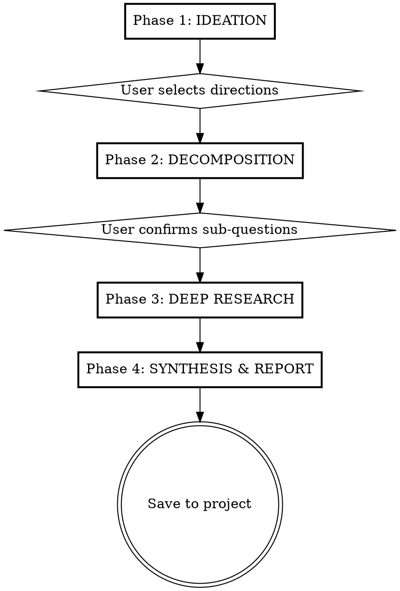

# Research Assistant

Run a complete research pipeline from initial exploration through citation-backed report. Each phase produces a markdown artifact saved to the project folder, building toward a final synthesis.

## Why This Skill Exists

Research is a process, not a single query. Good research requires first understanding *what* you're actually asking (which is rarely what you think you're asking), then systematically searching for answers across multiple domains, and finally synthesizing findings into something more useful than any individual source. This skill orchestrates that process so nothing falls through the cracks and every step builds on the last.

## Process Flow



## Checklist

Create a task for each phase and mark complete as you go:

1. **Set up project folder** — Create the research project directory and index
2. **Phase 1: Ideation** — Brainstorm with user, explore the question space, select directions
3. **Phase 2: Decomposition** — Break selected directions into parallel sub-questions
4. **Phase 3: Deep Research** — Dispatch parallel workers, collect findings
5. **Phase 4: Synthesis & Report** — Deduplicate, organize thematically, write the report
6. **Update project index** — Write Hemingway Bridge for next session

---

## Phase 1: IDEATION — Explore the Question Space

**Goal:** Transform a vague research interest into specific, well-formed research directions through collaborative dialogue.

**Invoke `/research-ideation`** with the user's topic. This runs the full four-phase ideation process:

1. **Divergent Ideation** — Generate candidate directions using analogical reasoning, constraint removal, inversion, and interdisciplinary connection
2. **Question Expansion** — Deepen the best directions using techniques the user selects (assumption interrogation, cross-disciplinary pollination, recursive deepening, etc.)
3. **Hypothesis Formulation** — Make selected questions precise enough to research
4. **Problem Selection** — Score and prioritize using generality, learning value, feasibility, impact

**Output artifact:** Save to `projects/{project}/ideation.md`
- All candidate directions explored
- The expansion techniques applied and what they revealed
- Formulated hypotheses with falsifiability tests
- Priority rankings with scores and rationale

**User decision point:** The user selects 2-5 directions to carry forward. Do not proceed to Phase 2 until they've chosen.

---

## Phase 2: DECOMPOSITION — Break Into Parallel Sub-Questions

**Goal:** Transform the selected research directions into independently answerable sub-questions, each matched to a source type and search strategy.

**Invoke `/query-decomposition`** with the ideation output. Feed it the selected directions and any context files.

The decomposition should:
- Produce 4-7 sub-questions (cap at 7 — more means the scope needs narrowing)
- Match each sub-question to a source type (web, academic, preprint, enterprise, structured)
- Specify a concrete search approach for each
- Map sub-questions back to the original hypotheses so coverage is clear

**Output artifact:** Save to `projects/{project}/query-decomposition.md`
- Each sub-question with source type and search approach
- Source plan summary table
- Hypothesis mapping (which sub-questions feed which hypotheses)

**User decision point:** Present the decomposition. Ask if any sub-questions are missing or if any should be adjusted. Breadth matters here — the goal is to cover every angle. If the user identifies gaps, add sub-questions before proceeding.

---

## Phase 3: DEEP RESEARCH — Dispatch Parallel Workers

**Goal:** Systematically collect, verify, and organize findings across all sub-questions simultaneously.

**Invoke `/deep-research`** using the query decomposition as input. This runs:

1. **Parallel dispatch** — Launch one research agent per sub-question. All agents run concurrently. Each agent:
   - Executes multiple search strategies for its sub-question
   - Deep-reads the 3-5 most promising sources (full content, not just snippets)
   - Scores each source for credibility (0-100)
   - Returns structured findings: claim, source URL, source type, summary, credibility score

2. **Source collection** — As each worker returns, note:
   - How many findings per sub-question
   - Any sub-questions with thin coverage (fewer than 5 sources)
   - Source diversity (are we over-reliant on one source type?)

3. **Gap identification** — After all workers return, check for:
   - Sub-questions with insufficient coverage → flag for user
   - Sources that couldn't be reached → present URLs to user so they can find them manually
   - Contradictions between workers' findings → preserve both sides

**Output artifacts:** Save individual worker results to `projects/{project}/research/sq{N}-{slug}.md`

Each worker output should include:
- The sub-question it was answering
- All findings with claims, sources, credibility scores
- A synthesis paragraph identifying key patterns

**Source handling:**
- For each source cited, record: URL, title/author, source type, credibility score, date accessed
- If a source cannot be reached (404, paywall, timeout), flag it and present the URL to the user: "I couldn't access these sources. Can you find them and paste the content?"
- The user may provide source content directly — incorporate it into findings

---

## Phase 4: SYNTHESIS & REPORT — Produce the Final Output

**Goal:** Transform parallel worker findings into a unified, thematic, citation-backed research report.

**Run the synthesis inline** (do not invoke a separate skill — you have all findings in context). Follow these steps:

### Step 1: Deduplication
- Identify claims that express the same assertion across multiple workers
- Keep each claim once but assign joint attribution (all source URLs)
- Joint attribution strengthens confidence

### Step 2: Contradiction Detection
- Flag opposing assertions with `[CONTESTED]`
- Present both claims with sources
- Assess which is better supported but do not resolve by picking sides

### Step 3: Thematic Grouping
- Organize by theme, not by worker or sub-question
- 2-3 major themes, 1-2 secondary themes, plus contested/uncertain and knowledge gaps sections

### Step 4: Confidence Scoring
- `[HIGH]` — 3+ genuinely independent sources agree
- `[MEDIUM]` — 2 independent sources, or 3+ that may share upstream
- `[LOW]` — Single source or sources that cite each other

### Step 5: Write the Report

**Output artifact:** Save to `{project}/research-report.md`

Use this structure:
```markdown
# {Topic}: Research Report
*Date | Sources: N | Confidence: [High/Medium/Low]*

## Executive Summary
[200-400 words: key findings, main conclusions, major caveats]

## Introduction
[Scope, methodology, what this covers and doesn't]

## {Theme 1}
[Prose-first, fully cited — every claim gets [N] inline]

## {Theme 2}
...

## Synthesis and Implications
[Patterns across themes, what the totality means]

## Limitations and Caveats
[Where evidence is thin, known biases, what couldn't be established]

## Recommendations
[Actionable conclusions from the evidence]

## Bibliography
[N] Author/Org (Year). "Title". Publication. URL

## Methodology Appendix
[Search queries used, databases searched]
```

**Writing standards:**
- Prose-first: 80%+ flowing prose, 20% or less bullets
- Every factual claim cited in the same sentence [N]
- Label synthesis explicitly: "This suggests..." or "Taken together..."
- Label speculation: "One possible interpretation is..."
- Never fabricate a citation — say "No sources found" instead

---

## Project Setup and File Organization

When the research begins, create this structure:

```
{project-folder}/
├── index.md              — Project home with goals, hypotheses, Hemingway Bridge
├── ideation.md           — Phase 1 output
├── query-decomposition.md — Phase 2 output
├── research/             — Phase 3 worker outputs
│   ├── sq1-{slug}.md
│   ├── sq2-{slug}.md
│   └── ...
└── research-report.md    — Phase 4 final report
```

The project folder location depends on context:
- If the user specifies a location, use it
- If working within an Obsidian vault with PARA structure, create under `/projects/{topic}/`
- Otherwise, use the current working directory

The `index.md` serves as the project home and Hemingway Bridge — always update it at the end of each session with where you left off and what to do next.

---

## Principles

**Breadth over depth in early phases.** The ideation and decomposition phases should explore every nook and cranny. It's cheap to generate directions and sub-questions; it's expensive to discover you missed an important angle after research is complete.

**Every phase produces an artifact.** Each phase writes a markdown file with its outcome. This creates a paper trail the user can review, share, and build on. It also means the process is resumable — if interrupted, pick up from the last saved artifact.

**Sources are first-class citizens.** Every claim traces to a URL. Sources that can't be reached are flagged for the user to find manually, not silently dropped. The bibliography is complete — every [N] has an entry.

**The user drives direction; the skill drives process.** The skill handles the mechanics (dispatching workers, deduplicating findings, organizing thematically). The user makes the strategic decisions (which directions to pursue, which sub-questions matter, whether the report answers their actual question).

**Respect the user's time at decision points.** When asking the user to select directions or confirm sub-questions, use multiple-choice questions (AskUserQuestion) with your recommendation marked. Don't ask open-ended "what do you think?" — propose and let them adjust.
